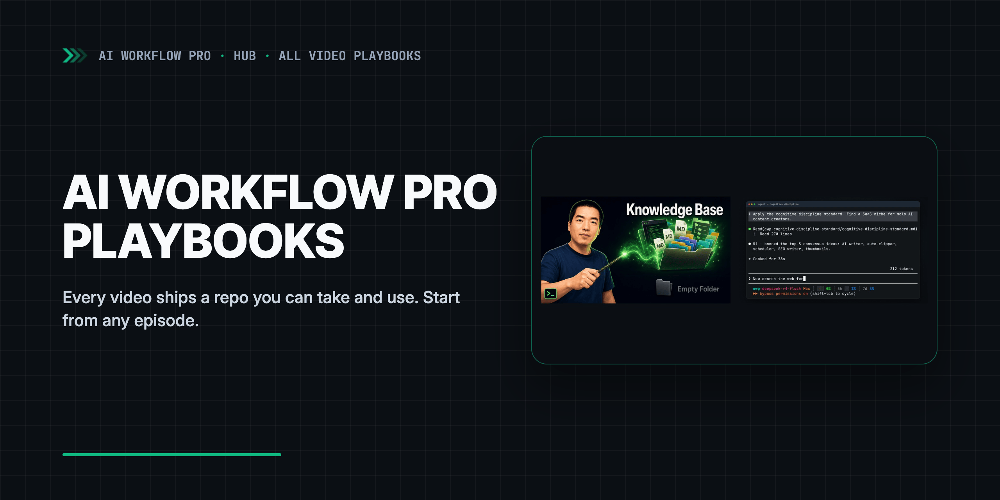

  <a href="https://www.youtube.com/channel/UCTVDdiLRI_7TkyFKmZ2-f7Q">
    <picture>
      <source media="(prefers-color-scheme: dark)" srcset=".github/assets/banner-dark.png">
      <source media="(prefers-color-scheme: light)" srcset=".github/assets/banner-light.png">
      
    </picture>
  </a>
  
▶ Watch the channel

# AI Agent Playbooks: One Repo for Every AI Workflow Pro Video

**AI agent playbooks from AI Workflow Pro videos: one repo per video you can copy into your own project. Claude Code, Codex, Cursor.**

---

## What this is

A playbook is a small public repo that ships with one AI Workflow Pro video. It holds what the
video shows — prompts, standards, templates and a worked example — so you can put it to work in
your own project instead of retyping it from the screen. Every playbook stands on its own: there is no
order, and you can start from any of them.

This hub is the index. Each video gets its own repo; the table below and
[`course.yaml`](course.yaml) list them all.

## Series: Build a Knowledge Base for AI Agents

[Playlist](https://www.youtube.com/playlist?list=PLCWXPPyW6CWA) · a knowledge base your agents read
as memory, then the standards, workflows and tools on top of it.

| Topic | Playbook | Video |
|---|---|---|
| A knowledge base as your company OS | — | [Watch](https://www.youtube.com/watch?v=h5BCeUMGuf8) |
| Build a knowledge base for AI agents from an empty folder | [awp-playbook-knowledgebase-skeleton](https://github.com/aiworkflowpro/awp-playbook-knowledgebase-skeleton/blob/main/README.md) | [Watch](https://www.youtube.com/watch?v=hmdKqGgIHyE) |
| Standards that make AI agents consistent | [awp-playbook-knowledgebase-standards](https://github.com/aiworkflowpro/awp-playbook-knowledgebase-standards/blob/main/README.md) | [Watch](https://www.youtube.com/watch?v=bpBhRBcKZOc) |

## How the playbooks work

| Repo type | What you get | Used when the video… |
|---|---|---|
| Follow-along | `steps/` prompts and `solutions/` to compare against | walks through a real build, step by step |
| Toolkit | Standards, prompts, a template and one worked example | explains a method you apply to your own project |
| Plugin | Skills and commands you install into your agent | ships a Skill or workflow |

Every playbook has an `AGENTS.md` (read by Codex, Cursor and others) with `CLAUDE.md` and
`GEMINI.md` pointing at it, so the same repo works in Claude Code, Codex, Cursor and Gemini CLI.
Each one is tagged at the video's release, and the README says which version the video uses.

## Short videos, concepts and talks

Videos without a repo of their own get a page here: [`concepts/`](concepts/README.md) for
explainers, [`tips/`](tips/README.md) for short videos, [`talks/`](talks/README.md) for
conversations.

## License

Text and pages in this hub: [CC BY 4.0](LICENSE). Code and configuration: [MIT](LICENSE-CODE).

---

  <a href="https://aiworkflowpro.com">
    <picture>
      <source media="(prefers-color-scheme: dark)" srcset="https://raw.githubusercontent.com/aiworkflowpro/.github/main/assets/wordmark-dark.png">
      
    </picture>
  </a>
   
  <a href="https://github.com/aiworkflowpro">github.com/aiworkflowpro</a> · <a href="https://aiworkflowpro.com">aiworkflowpro.com</a> · <a href="https://x.com/aiworkflowprolk">X</a> · <a href="https://www.youtube.com/channel/UCTVDdiLRI_7TkyFKmZ2-f7Q">YouTube</a>
    
  <i>The models get better. Someone still has to use them.</i>

